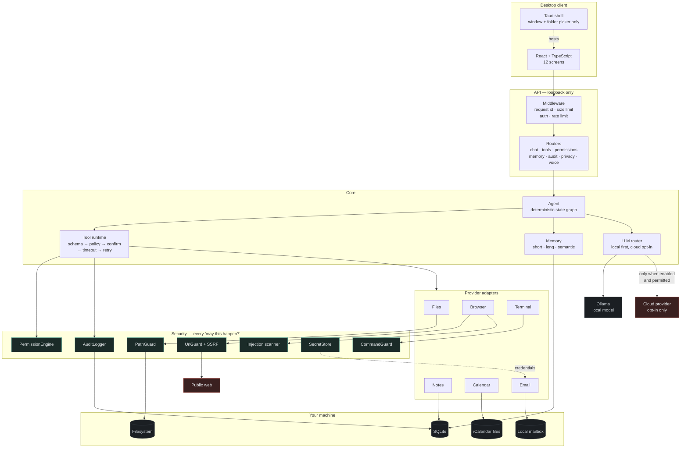

# System architecture

```mermaid
flowchart TB
    subgraph client["Desktop client"]
        UI["React + TypeScript<br/>12 screens"]
        TAURI["Tauri shell<br/>window + folder picker only"]
    end

    subgraph api["API — loopback only"]
        MW["Middleware<br/>request id · size limit<br/>auth · rate limit"]
        R["Routers<br/>chat · tools · permissions<br/>memory · audit · privacy · voice"]
    end

    subgraph core["Core"]
        AGENT["Agent<br/>deterministic state graph"]
        RUNTIME["Tool runtime<br/>schema → policy → confirm<br/>→ timeout → retry"]
        MEM["Memory<br/>short · long · semantic"]
        ROUTER["LLM router<br/>local first, cloud opt-in"]
    end

    subgraph sec["Security — every 'may this happen?'"]
        PATHS["PathGuard"]
        CMDS["CommandGuard"]
        URLS["UrlGuard + SSRF"]
        INJ["Injection scanner"]
        POL["PermissionEngine"]
        SEC["SecretStore"]
        AUD["AuditLogger"]
    end

    subgraph prov["Provider adapters"]
        F["Files"]; N["Notes"]; C["Calendar"]
        E["Email"]; B["Browser"]; T["Terminal"]
    end

    subgraph local["Your machine"]
        FS[("Filesystem")]
        DB[("SQLite")]
        ICS[("iCalendar files")]
        MAIL[("Local mailbox")]
    end

    OLLAMA["Ollama<br/>local model"]
    CLOUD["Cloud provider<br/>opt-in only"]
    WEB["Public web"]

    UI --> MW --> R --> AGENT
    TAURI -.hosts.-> UI
    AGENT --> RUNTIME
    AGENT --> MEM
    AGENT --> ROUTER
    RUNTIME --> POL
    RUNTIME --> AUD
    RUNTIME --> prov

    F --> PATHS --> FS
    T --> CMDS
    B --> URLS --> WEB
    B --> INJ
    N --> DB
    C --> ICS
    E --> MAIL
    MEM --> DB
    AUD --> DB
    SEC -.credentials.-> E

    ROUTER --> OLLAMA
    ROUTER -.only when enabled<br/>and permitted.-> CLOUD

    classDef danger fill:#3a2020,stroke:#d97066,color:#e6e9ec
    classDef safe fill:#1b2b28,stroke:#5eb3a1,color:#e6e9ec
    classDef neutral fill:#1b1f23,stroke:#3a424a,color:#c9cfd5
    class CLOUD,WEB danger
    class PATHS,CMDS,URLS,INJ,POL,SEC,AUD safe
    class FS,DB,ICS,MAIL,OLLAMA neutral
```
