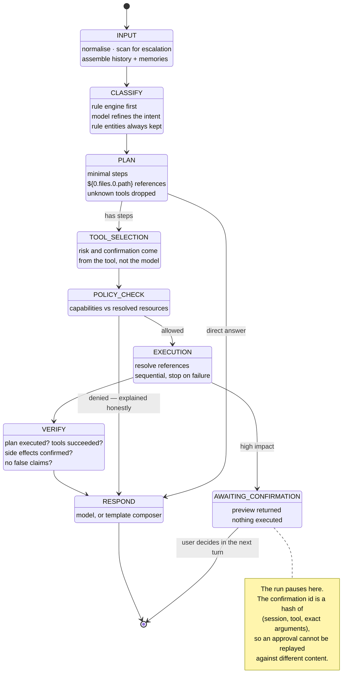

# Agent workflow

```mermaid
stateDiagram-v2
    [*] --> INPUT

    INPUT: INPUT
    INPUT: normalise · scan for escalation
    INPUT: assemble history + memories

    CLASSIFY: CLASSIFY
    CLASSIFY: rule engine first
    CLASSIFY: model refines the intent
    CLASSIFY: rule entities always kept

    PLAN: PLAN
    PLAN: minimal steps
    PLAN: ${0.files.0.path} references
    PLAN: unknown tools dropped

    SELECT: TOOL_SELECTION
    SELECT: risk and confirmation come
    SELECT: from the tool, not the model

    POLICY: POLICY_CHECK
    POLICY: capabilities vs resolved resources

    EXEC: EXECUTION
    EXEC: resolve references
    EXEC: sequential, stop on failure

    CONFIRM: AWAITING_CONFIRMATION
    CONFIRM: preview returned
    CONFIRM: nothing executed

    VERIFY: VERIFY
    VERIFY: plan executed? tools succeeded?
    VERIFY: side effects confirmed?
    VERIFY: no false claims?

    RESPOND: RESPOND
    RESPOND: model, or template composer

    INPUT --> CLASSIFY
    CLASSIFY --> PLAN
    PLAN --> SELECT: has steps
    PLAN --> RESPOND: direct answer
    SELECT --> POLICY
    POLICY --> EXEC: allowed
    POLICY --> RESPOND: denied — explained honestly
    EXEC --> CONFIRM: high impact
    CONFIRM --> [*]: user decides in the next turn
    EXEC --> VERIFY
    VERIFY --> RESPOND
    RESPOND --> [*]

    note right of CONFIRM
        The run pauses here.
        The confirmation id is a hash of
        (session, tool, exact arguments),
        so an approval cannot be replayed
        against different content.
    end note
```
