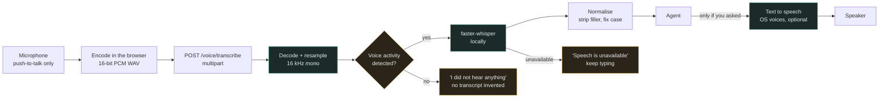

# Voice pipeline

Properties this diagram encodes:

- The microphone opens on press and every track is stopped on release, so the OS
  indicator reflects reality.
- Audio is processed in memory. The server never writes it to disk.
- Silence produces an empty transcript and a clear message, never a hallucinated
  one.
- Speech never bypasses a permission or confirmation: a transcript is just text
  entering the same graph.
