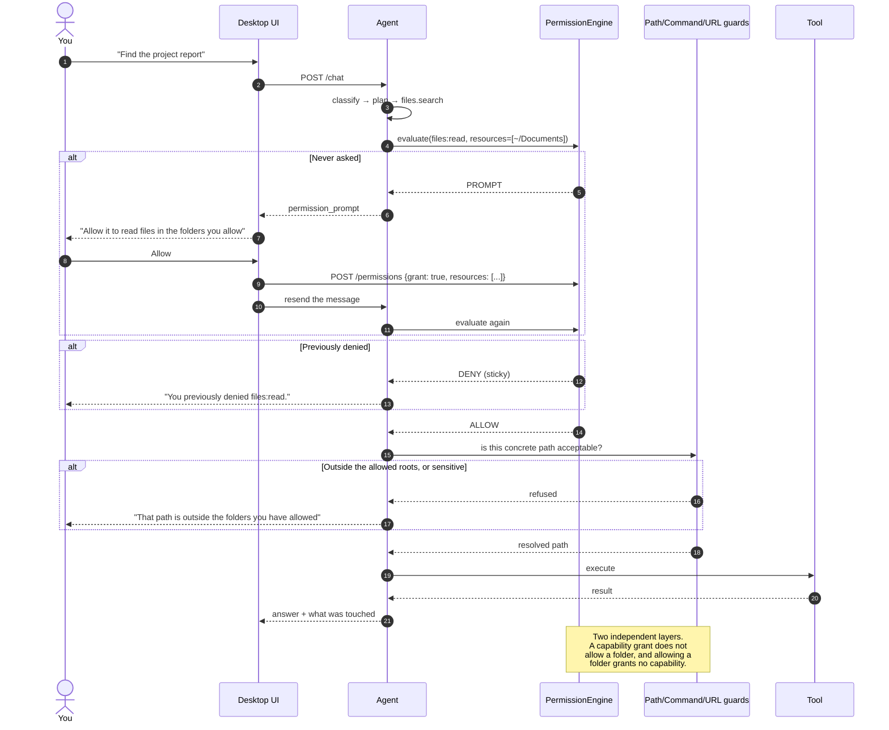

# Permission flow

```mermaid
sequenceDiagram
    autonumber
    actor U as You
    participant UI as Desktop UI
    participant A as Agent
    participant P as PermissionEngine
    participant G as Path/Command/URL guards
    participant T as Tool

    U->>UI: "Find the project report"
    UI->>A: POST /chat
    A->>A: classify → plan → files.search
    A->>P: evaluate(files:read, resources=[~/Documents])

    alt Never asked
        P-->>A: PROMPT
        A-->>UI: permission_prompt
        UI-->>U: "Allow it to read files in the folders you allow"
        U->>UI: Allow
        UI->>P: POST /permissions {grant: true, resources: [...]}
        UI->>A: resend the message
        A->>P: evaluate again
    end

    alt Previously denied
        P-->>A: DENY (sticky)
        A-->>U: "You previously denied files:read."
    end

    P-->>A: ALLOW
    A->>G: is this concrete path acceptable?

    alt Outside the allowed roots, or sensitive
        G-->>A: refused
        A-->>U: "That path is outside the folders you have allowed"
    end

    G-->>A: resolved path
    A->>T: execute
    T-->>A: result
    A-->>UI: answer + what was touched

    Note over P,G: Two independent layers.<br/>A capability grant does not<br/>allow a folder, and allowing a<br/>folder grants no capability.
```
