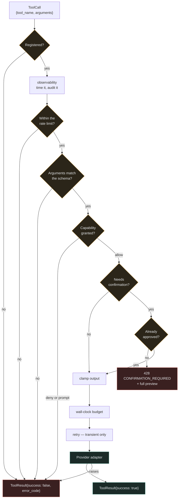

# Tool execution lifecycle

Every gate runs on every call. There is no fast path, no cached decision, and no
way for a caller to skip a stage — `ToolRuntime.execute` is the only entry point
and it composes the chain itself.
