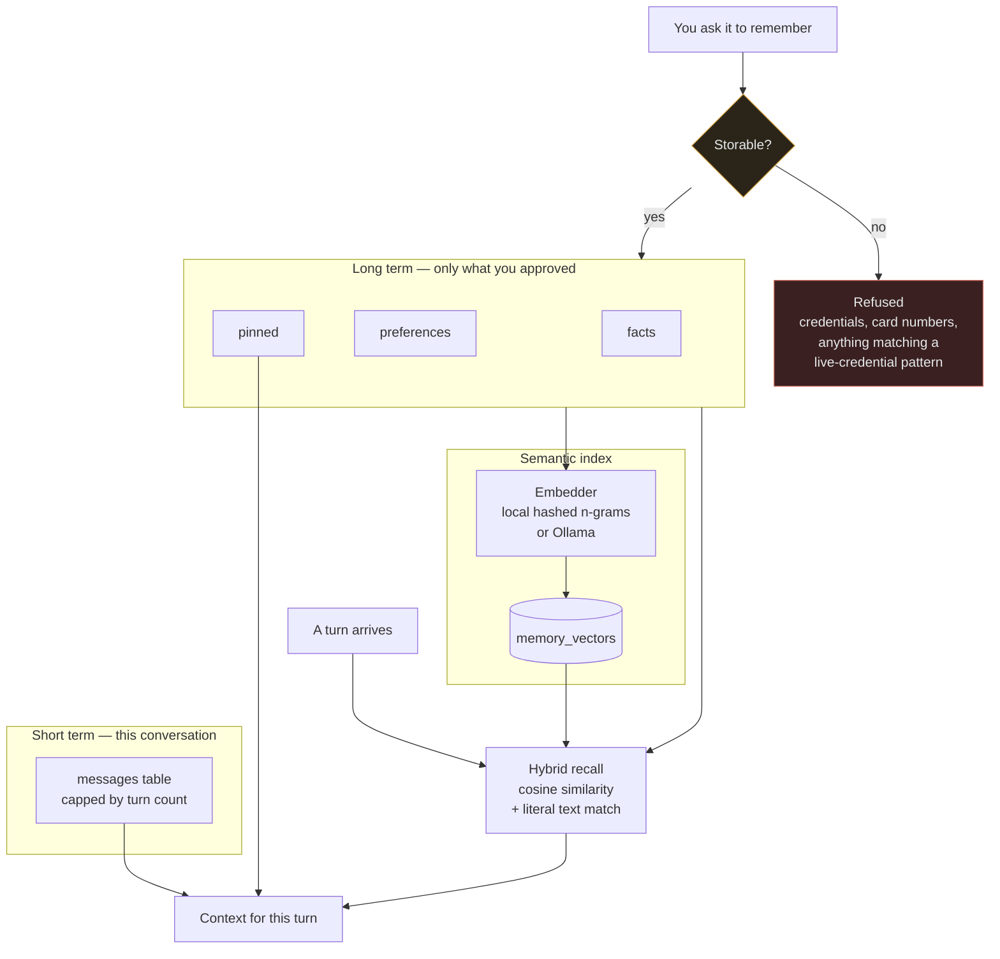

# Memory architecture

Why recall is hybrid: an embedding finds "who manages the analytics team" from
"Rahul is the project manager", but it will not reliably find "BA287". Literal
matching does exactly the opposite. Users need both, so both run and the scores
are merged.

Every record carries provenance (`user:explicit`, `run:<id>`), so the question
"why do you know that?" always has an answer.
