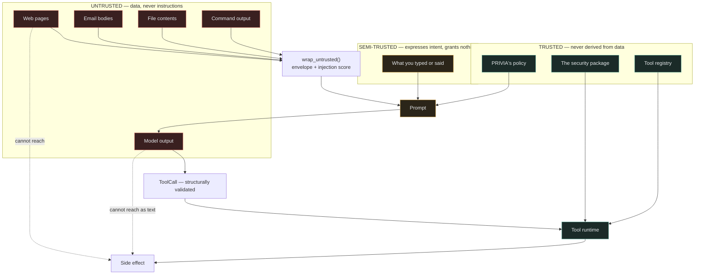

# Security boundaries

The dotted lines are the point. Untrusted content can influence what the model
*says*. It cannot reach a side effect, because the only thing that reaches the
runtime is a validated `ToolCall`, and the runtime checks capabilities regardless
of what any text claimed.
