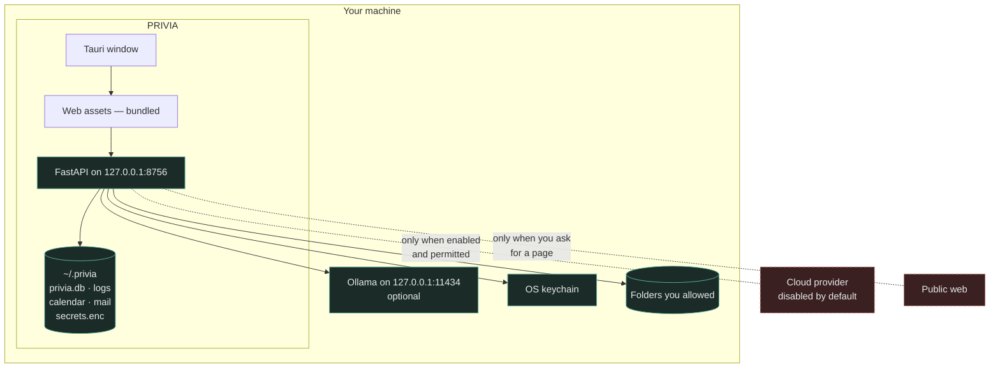
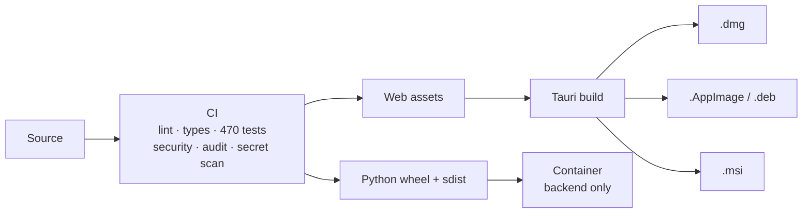

# Deployment

```mermaid
flowchart TB
    subgraph machine["Your machine"]
        subgraph app["PRIVIA"]
            TAURI["Tauri window"]
            VITE["Web assets — bundled"]
            API["FastAPI on 127.0.0.1:8756"]
            DATA[("~/.privia<br/>privia.db · logs<br/>calendar · mail<br/>secrets.enc")]
        end
        OLLAMA["Ollama on 127.0.0.1:11434<br/>optional"]
        KEY["OS keychain"]
        DOCS[("Folders you allowed")]
    end

    CLOUD["Cloud provider<br/>disabled by default"]
    WEB["Public web"]

    TAURI --> VITE --> API
    API --> DATA
    API --> DOCS
    API --> OLLAMA
    API --> KEY
    API -.-|"only when enabled<br/>and permitted"| CLOUD
    API -.-|"only when you ask<br/>for a page"| WEB

    classDef off fill:#3a2020,stroke:#d97066,color:#e6e9ec,stroke-dasharray: 4 4
    classDef local fill:#1b2b28,stroke:#5eb3a1,color:#e6e9ec
    class CLOUD,WEB off
    class API,DATA,OLLAMA,KEY,DOCS local
```

## Distribution

```mermaid
flowchart LR
    SRC["Source"] --> CI["CI<br/>lint · types · 470 tests<br/>security · audit · secret scan"]
    CI --> PY["Python wheel + sdist"]
    CI --> WEB2["Web assets"]
    WEB2 --> TB["Tauri build"]
    TB --> MAC[".dmg"]
    TB --> LIN[".AppImage / .deb"]
    TB --> WIN[".msi"]
    PY --> DOCKER["Container<br/>backend only"]
```

There is no update server and no phone-home. Releases are downloaded
deliberately.
